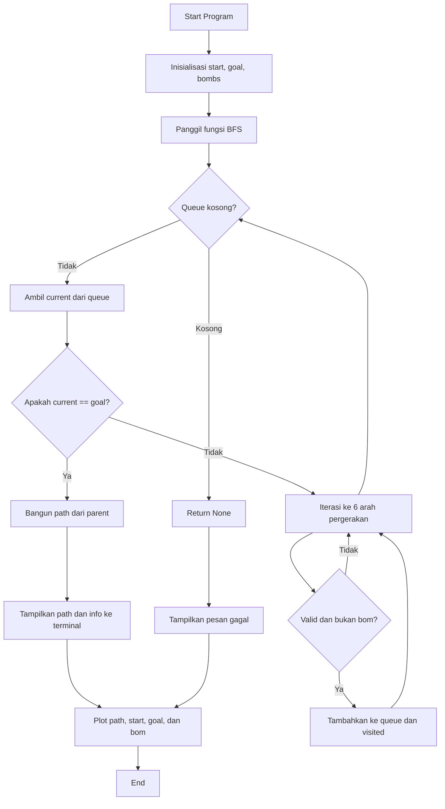

# Robot Pathfinding in 3D Rubik-like Building

## Anggota Kelompok:
1. 2308355 RAFFI ADZRIL ALFAIZ
2. 2308428	LYAN NAZHABIL DZUQUWWA
3. 2308882	NARENDRA RIDHA BAIHAQI
4. 2307589	FARIZ WIBISONO
5. 2308817	HAFIDZ TANTOWI
6. 2306924	MUHAMMAD ICHSAN KHAIRULLAH


## Problem Statement

Bayangkan sebuah robot berada di dalam sebuah gedung 3D berukuran 10x10x10 yang menyerupai struktur rubik. Tugas robot ini adalah menemukan **rute terpendek** dari titik **start** ke titik **goal** menggunakan pergerakan 6 arah (atas, bawah, kiri, kanan, depan, belakang). 

Namun, ada **bom** di beberapa koordinat yang tidak boleh diinjak oleh robot. Jika robot menyentuh bom, maka dianggap gagal. Oleh karena itu, sistem harus mencari jalur yang **aman** dan **efisien**, jika memungkinkan.

### Tujuan
- Menentukan apakah ada rute aman dari titik awal ke titik tujuan.
- Menampilkan rute tersebut baik di **terminal** maupun dalam bentuk **visualisasi 3D**.
- Jika tidak ada rute yang bisa ditempuh karena bom menghalangi, tampilkan pesan kegagalan.

---

## Flow Chart


---

## Pseudocode

```text
INPUT: 
    start ← koordinat awal (x,y,z)
    goal ← koordinat tujuan (x,y,z)
    bombs ← daftar koordinat yang mengandung bom

FUNCTION is_valid(x, y, z, visited, bombs)
    RETURN (x,y,z) berada dalam batas gedung AND belum dikunjungi AND bukan bom

FUNCTION bfs(start, goal, bombs)
    INIT queue ← kosong
    INIT visited ← kosong
    INIT parent ← kosong

    Tambahkan start ke queue
    Tandai start sebagai dikunjungi

    WHILE queue tidak kosong DO
        current ← queue.pop()
        IF current == goal THEN
            path ← []
            WHILE current ≠ start DO
                path.append(current)
                current ← parent[current]
            path.append(start)
            BALIKKAN path
            RETURN path
        ENDIF

        FOR setiap arah gerakan (6 arah) DO
            nx, ny, nz ← current + arah
            IF is_valid(nx, ny, nz, visited, bombs) THEN
                Tambahkan (nx, ny, nz) ke queue
                Tandai (nx, ny, nz) sebagai dikunjungi
                parent[(nx, ny, nz)] ← current
            ENDIF
        ENDFOR
    ENDWHILE

    RETURN None (tidak ada jalan)

MAIN:
    path ← bfs(start, goal, bombs)

    IF path ditemukan THEN
        Cetak "Rute ditemukan" dan tampilkan langkah-langkahnya
    ELSE
        Cetak "Tidak ada rute ditemukan"

    Visualisasikan dalam plot 3D:
        - Titik bom (merah)
        - Jalur (biru)
        - Start (hijau)
        - Goal (ungu)
        - Skala dan label sumbu lengkap (0–9)
```

---

## Contoh Running Code
### Input
```python
start = (0, 0, 0)  # Titik awal robot
goal = (9, 9, 9)   # Titik tujuan robot
bombs = [  # Daftar koordinat bom yang harus dihindari
    (0,1,0), (1,1,0), (2,2,0),
    (3,3,3), (5,5,5), (7,7,7),
    (8,8,8), (9,9,8)
]
```
### Output
1. Output Terminal


2. Output Plot


---

## Analisis Kompleksitas Waktu

### Fungsi BFS:

Dalam kasus terburuk, algoritma BFS akan menjelajahi setiap posisi dalam grid 3D. Grid ini berukuran 10x10x10, yang berarti ada **1000 posisi** yang harus dieksplorasi.

BFS akan mengunjungi setiap posisi yang valid hanya sekali, dan setiap posisi akan diperiksa dalam 6 arah pergerakan.

Oleh karena itu, kompleksitas waktu dari fungsi BFS adalah **O(n)**, di mana **n** adalah jumlah total posisi dalam grid. Dalam kasus ini, **n = 1000**.

### Fungsi is_valid:

Fungsi ini dipanggil untuk setiap posisi yang berdekatan selama proses BFS. Fungsi ini memeriksa apakah posisi tersebut berada dalam batas grid, belum dikunjungi, dan bukan bom. Karena operasi ini memeriksa kondisi tertentu secara langsung, kompleksitas waktu untuk setiap pemanggilan fungsi ini adalah **O(1)**.

### Kompleksitas Keseluruhan:

Kompleksitas keseluruhan didominasi oleh fungsi BFS, yang memeriksa semua posisi dalam grid. Oleh karena itu, kompleksitas waktu keseluruhan adalah **O(n)**, di mana **n** adalah jumlah total posisi yang harus dijelajahi dalam grid. Dalam kasus ini, **n = 1000**, sehingga kompleksitasnya **O(1000)**.

---

Dengan cara ini, **O(n)** merujuk pada jumlah posisi dalam grid, dan kita bisa memahami bahwa semakin besar **n**, semakin banyak posisi yang akan diperiksa oleh algoritma BFS.


